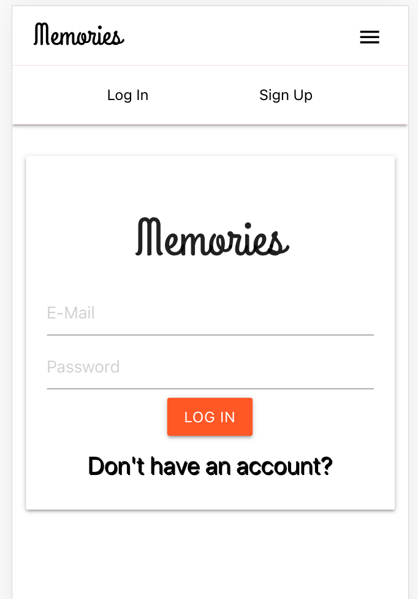
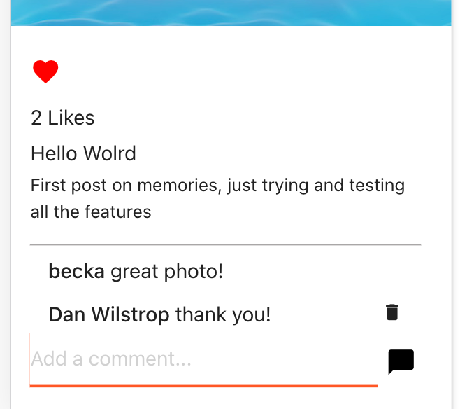
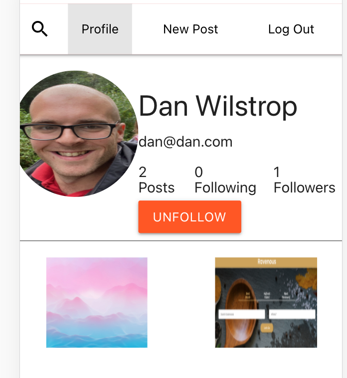
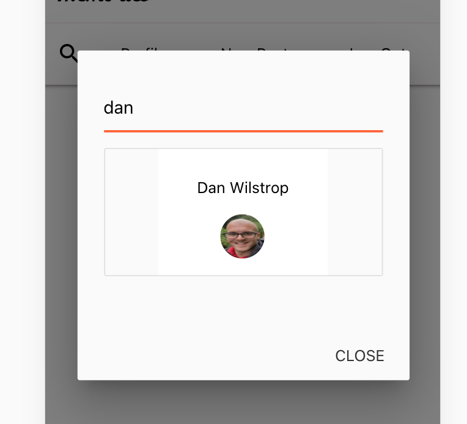
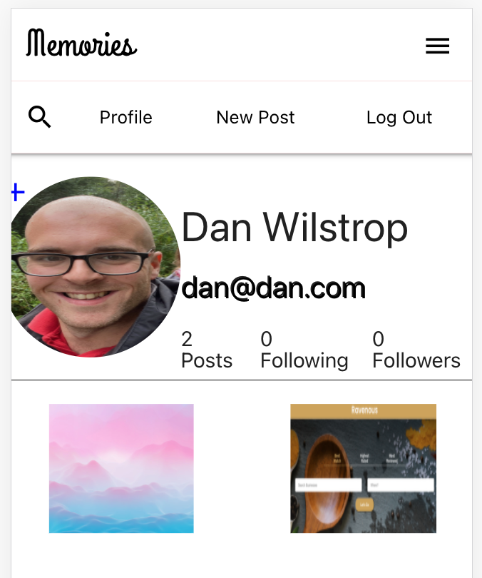
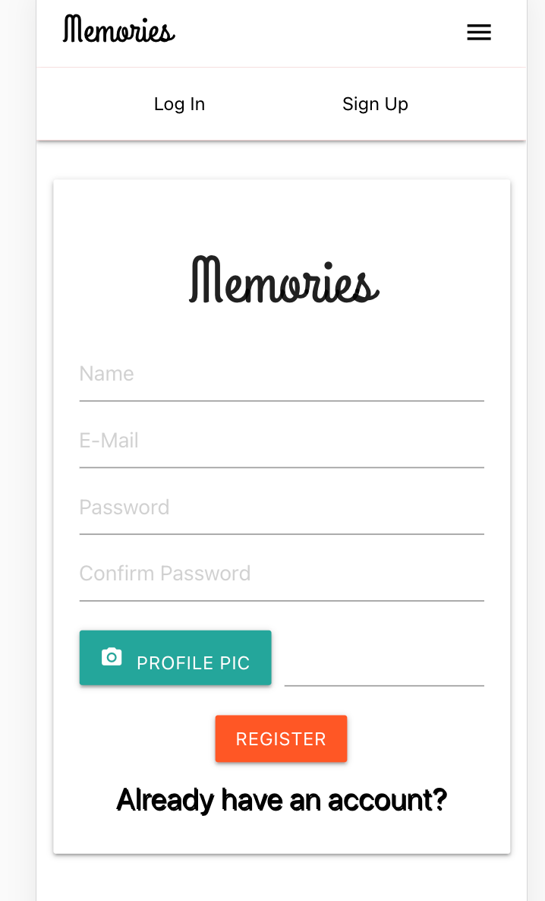

### Memories - MERN stack social media app ###

This project was bootstrapped with [Create React App](https://github.com/facebook/create-react-app).

Full stack socila media app made with the MERN stack.

 
# Tech Used #
- React
- Node.js
- Express
- MongoDB/Mongoose
- Materiallize library for styles 

# To-Do #

- [ ] Delete account functionality
- [ ] Forogtten password/username links using NodeMailer 
- [ ] Live Chat with other Users feature 
- [ ] Display list of followers/following on click + chat or view profile options
- [ ] Notifications
- [ ] Reduce code length per file with new componets and fetch functions in seperate files

